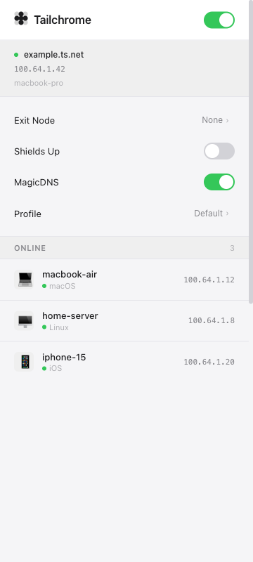
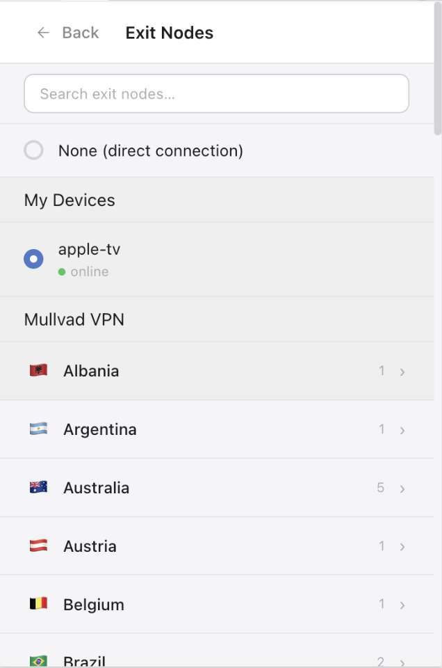

# Tailchrome

Access your Tailscale network directly from your browser. No system VPN required.


[Chrome Web Store](https://chromewebstore.google.com/detail/tailchrome/bhfeceecialgilpedkoflminjgcjljll) | [Firefox Add-ons](https://addons.mozilla.org/en-US/firefox/addon/tailchrome/) | [tesseras.org/tailchrome](https://tesseras.org/tailchrome/)

Tailchrome runs a full Tailscale node per browser profile, without touching system networking. Works in Chrome, Firefox, and other Chromium-family browsers (Brave, Edge, Vivaldi, Opera, Arc) with full feature parity. Tailnet traffic is routed through a local SOCKS5/HTTP proxy, so it works alongside (or without) the Tailscale system app.

<p align="center">
  &nbsp;&nbsp;&nbsp;&nbsp;
</p>

## Features

- **Per-profile isolation** — each browser profile gets its own independent Tailscale node and identity
- **Exit nodes** — route all browser traffic through any exit node on your tailnet, with a "Best available" recommendation that picks a nearby Mullvad location when one is available
- **MagicDNS** — access devices by name, not IP
- **Subnet routing** — reach resources behind subnet routers
- **Profiles** — create and switch between multiple Tailscale identities
- **Side panel** — opt in to keep the UI docked while you browse (Chrome side panel, Firefox sidebar)
- **Shields Up** — block incoming connections for extra security

## How it works

The extension has two parts:

- A **browser extension** (Manifest V3, Chrome and Firefox) that manages proxy configuration and provides the popup UI
- A **native host** (Go, using `tsnet`) that runs the actual Tailscale node and exposes a local proxy

They communicate over the browser's native messaging protocol. See the [full documentation](docs/DOCUMENTATION.md) for details.

### Side panel mode

By default, clicking the Tailchrome toolbar icon opens a popup that dismisses on click-away. If you'd rather keep the UI visible while you browse, flip **Open as side panel** in the popup's quick settings:

- **Chrome:** the side panel opens on toolbar click and stays open until you close it. Chrome keeps the extension's service worker alive while the panel is visible, so peer status updates feel snappier.
- **Firefox:** the toolbar click opens Tailchrome in the sidebar. Flip the toggle from inside the sidebar to switch back to popup mode.

The same UI renders in either surface.

## Install

1. Get the extension from the [Chrome Web Store](https://chromewebstore.google.com/detail/tailchrome/bhfeceecialgilpedkoflminjgcjljll) (also installs in Brave, Edge, Vivaldi, Opera, and Arc) or [Firefox Add-ons](https://addons.mozilla.org/en-US/firefox/addon/tailchrome/)
2. Install the native helper from the [latest release](https://github.com/dantraynor/tailchrome/releases/latest) — on macOS, download and open **`tailchrome-helper-macos.pkg`**; on other platforms, download the binary and run it. The helper auto-installs the native messaging manifest into every supported browser it detects on your machine.
3. Log in to your Tailscale account

## Development

```
pnpm install --frozen-lockfile
make dev              # Chrome extension (watch mode)
make host             # Native host binary
```

PRs run CI (lint, typecheck, tests, Firefox review gate). Tagged releases build all artifacts and publish to the Chrome Web Store and Firefox Add-ons. See [CONTRIBUTING.md](docs/CONTRIBUTING.md) for full setup and build commands.

## Contributing

Bug reports and feature requests are welcome. Please open an issue before submitting a PR so we can discuss the approach. See [CONTRIBUTING.md](docs/CONTRIBUTING.md) for guidelines.

## License

MIT
