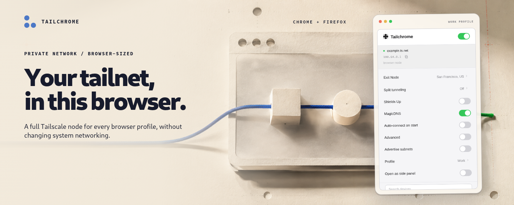
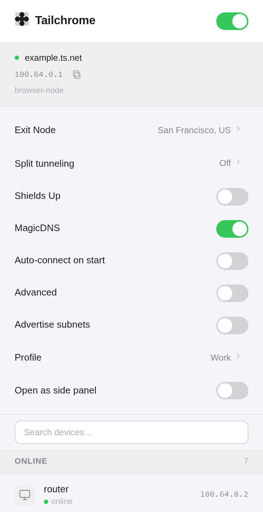
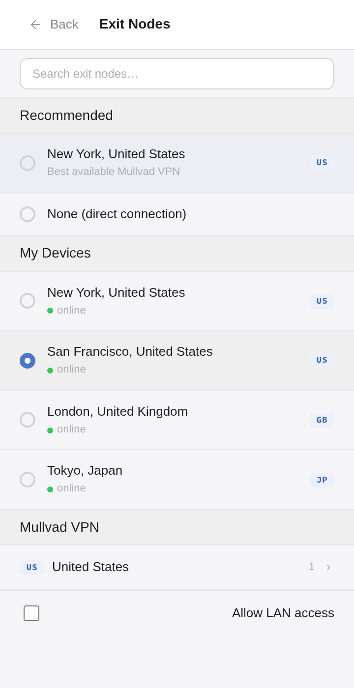

# Tailchrome

Access your Tailscale network directly from your browser. No system VPN required.



[Chrome Web Store](https://chromewebstore.google.com/detail/tailchrome/bhfeceecialgilpedkoflminjgcjljll) | [Firefox Add-ons](https://addons.mozilla.org/en-US/firefox/addon/tailchrome/) | [tesseras.org/tailchrome](https://tesseras.org/tailchrome/)

Tailchrome runs a full Tailscale node per browser profile, without touching system networking. Works in Chrome, Firefox, and other Chromium-family browsers (Brave, Edge, Vivaldi, Opera, plus Arc on macOS) with full feature parity. Tailnet traffic is routed through a local SOCKS5/HTTP proxy, so it works alongside (or without) the Tailscale system app.

<p align="center">
  
  
</p>

## Features

- **Per-profile isolation** — each browser profile gets its own independent Tailscale node and identity
- **Exit nodes** — route all browser traffic through any exit node on your tailnet, with a "Best available" recommendation that picks a nearby Mullvad location when one is available
- **Split-tunneling** — pick domains that bypass your exit node (handy for sites that flag VPN traffic), or restrict the exit node to only the domains you list
- **MagicDNS** — access devices by name, not IP
- **Split DNS** — resolve internal domains using restricted nameservers configured in Tailscale or Headscale ([setup and testing](docs/split-dns.md))
- **Subnet routing** — reach IPv4 and IPv6 resources behind subnet routers
- **Profiles** — create and switch between multiple Tailscale identities
- **Device shortcuts** — a compact device list with one-click IP copying, full-list search, and a “View all” option
- **Routing status** — see whether browser routing is active, blocked, or unavailable separately from the node's connection
- **Custom coordination servers** — connect a browser profile to a self-hosted control server such as Headscale
- **Side panel** — opt in to keep the UI docked while you browse (Chrome side panel, Firefox sidebar)
- **Auto-connect on start** — optional toggle that brings the tailnet up when the browser launches
- **Shields Up** — block incoming connections for extra security

## How it works

The extension has two parts:

- A **browser extension** (Manifest V3, Chrome and Firefox) that manages proxy configuration and provides the popup UI
- A **native host** (Go, using `tsnet`) that runs the actual Tailscale node and exposes a local proxy

They communicate over the browser's native messaging protocol. See the [full documentation](docs/DOCUMENTATION.md) for details.

### Side panel mode

By default, clicking the Tailchrome toolbar icon opens a popup that dismisses on click-away. If you'd rather keep the UI visible while you browse, flip **Open as side panel** in the popup's quick settings:

- **Chrome:** the side panel opens on toolbar click and stays open until you close it. Chrome keeps the extension's service worker alive while the panel is visible, so peer status updates feel snappier.
- **Firefox:** the toolbar click opens Tailchrome in the sidebar. Flip the toggle from inside the sidebar to switch back to popup mode.

The same UI renders in either surface.

## Install

1. Get the extension from the [Chrome Web Store](https://chromewebstore.google.com/detail/tailchrome/bhfeceecialgilpedkoflminjgcjljll) (also installs in Brave, Edge, Vivaldi, Opera, and — on macOS — Arc) or [Firefox Add-ons](https://addons.mozilla.org/en-US/firefox/addon/tailchrome/)
2. Open the extension and follow its per-user helper setup: the helper app on macOS, the Windows installer or native ARM64 PowerShell installer, or one terminal command on Linux. These install for your account without administrator access. [Homebrew](#homebrew-macos-and-linux) and system packages remain available.
3. Log in to your Tailscale account

### Terminal installation

The simplified installer and CLI require helper **v0.1.14 or later**. Until that
release is published, use the installers and instructions attached to the
[current release](https://github.com/dantraynor/tailchrome/releases/latest).

On macOS or Linux:

```bash
curl -fsSL https://github.com/dantraynor/tailchrome/releases/latest/download/tailchrome-install.sh | bash
```

On Windows, in PowerShell:

```powershell
irm https://github.com/dantraynor/tailchrome/releases/latest/download/tailchrome-install.ps1 | iex
```

The installer selects and verifies the matching helper, places it at a stable
user-owned path, and registers it with your browsers. Rerun the same installer
to upgrade or repair registration. Downloads can also be inspected and pinned
to a release. See [helper installation](docs/helper-installation.md) for paths,
custom browser IDs, safe upgrades, removal, and Chrome Flatpak setup.

### Homebrew (macOS and Linux)

Add this repository as a tap once:

```bash
brew tap dantraynor/tailchrome https://github.com/dantraynor/tailchrome
```

On macOS, install the signed helper package with
`brew install --cask dantraynor/tailchrome/tailchrome`.

To build the helper from source on Linux or macOS, run:

```bash
brew install --formula dantraynor/tailchrome/tailchrome
tailscale-browser-ext -install-now
```

The formula installs Go as a build dependency. Follow `brew info` for the
registration command supported by the formula's pinned release. Starting with
v0.1.14, direct registration uses Homebrew's stable `opt` path, so upgrades do
not require refreshing a separate runtime copy. Older formula releases still
require repeating `-install-now` after upgrading. See the
[Homebrew instructions](packaging/homebrew/README.md) for upgrades, repair,
and removal. The browser extension is installed separately.

### Platform installers

On macOS, open the downloaded ZIP and launch **Tailchrome Helper**. The app
contains the helper and registers it for your account. The app and system
package are signed and notarized. Organization browser policies can still
block extensions or native messaging.

A signed Windows release verifies both raw helpers, the embedded amd64
helper, and the outer MSI under the
[Windows code-signing policy](docs/WINDOWS_CODE_SIGNING_POLICY.md). Explicit
unsigned releases disclose that exception. Linux packages are covered by the release
checksum and build-provenance attestation. If Tailchrome still cannot discover
the helper after the package is installed, the popup
offers a current-user registration repair for the browser that requested it.
On macOS, reopen `~/Applications/Tailchrome Helper.app` for the per-user app,
or `/Applications/Tailchrome Helper.app` for the system package. The per-user installer resolves one release version, checks the
downloaded helper before running it, and uses the helper's own registration
targets. Explicit version pinning remains available; see the
[Linux](packaging/linux/README.md) and [macOS](packaging/macos/README.md)
instructions.

Helper version differences alone do not disable the connection: compatible
helpers show a non-blocking release notice, and optional features use the
capabilities the helper advertises. **Upgrade the extension and helper together
for v0.1.14.** Its authenticated proxy is a required capability: the new extension
rejects older helpers without it, and older extensions cannot authenticate to
the new helper. Complete both updates before resuming protected browsing.
Helper diagnostic reports
are created only when you choose **Copy diagnostic report** or
**Export diagnostic report**; they remain local until you copy, save, or share
them.

Release artifacts are assembled and checksummed only after platform signing
and packaging. Windows publication is additionally gated by the
[Windows code-signing policy](docs/WINDOWS_CODE_SIGNING_POLICY.md) and the
[release security checklist](docs/RELEASE_CHECKLIST.md).

## Code signing policy

SignPath Foundation has accepted Tailchrome for Windows Authenticode signing.
[Test-signing setup](docs/signpath-setup.md) is underway; production certificate
issuance and release integration are still pending. Windows releases remain
explicitly unsigned until those steps are complete. The public
[Windows code-signing policy](docs/WINDOWS_CODE_SIGNING_POLICY.md) defines who
may submit and approve signing requests, which builds are eligible, how
signatures are verified, and how a compromised or replaced publisher identity
is handled.

For releases signed through the SignPath Foundation program:

> Free code signing provided by SignPath.io, certificate by SignPath Foundation

## Development

```
pnpm install --frozen-lockfile
make dev              # Chrome extension (watch mode)
make host             # Native host binary
```

PRs run CI (lint, typecheck, TypeScript and Go tests, browser tests,
packaging checks, and the Firefox review gate). A release tag assembles one
immutable helper candidate; the protected publication workflow publishes only
the cleared candidate bytes. Chrome Web Store and Firefox Add-ons submissions
remain separate gated jobs. See [CONTRIBUTING.md](docs/CONTRIBUTING.md) for
full setup and build commands.

## Contributing

Bug reports and feature requests are welcome. Please open an issue before submitting a PR so we can discuss the approach. See [CONTRIBUTING.md](docs/CONTRIBUTING.md) for guidelines.

## License

MIT
